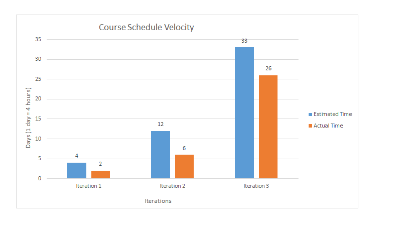

What technical debt has been cleaned up? Show links to a commit where you paid off technical debt. Write 2-5 sentences that explain what debt was paid, and what its classification is.
For technical debt we had testing and database. Both were prudent debts. We didn’t get time to write tests for our iteration 2, but we knew that for next iteration we would have to do testing for old and new code. We decided that adding another feature was more important at that moment. As for database, initially we wanted to implement functionality about adding courses, but our database was creating only students table. So, because of that we had to change what features we will deliver for iteration 2, just so we will have something working and worry about the database in the next iteration.

What technical debt did you leave? What one item would you like to fix, and can't? Anything you write will not be marked negatively. Classify this debt.
As of now we don’t have anything that we need to fix or change. There might be a bug that our team is missing, but everything that was planned for iteration 3 was implemented and thoroughly tested. 

Discuss a Feature or User Story that was cut/re-prioritized. When did you change the priority of a Feature or User Story? Why was it re-prioritized? Provide a link to the Feature or User Story. This can be from any iteration.
We had to cut quite a few features. We had some ideas involving a calendar like show due dates for assignments for the courses student is registered in, add your own remainders in the calendar. Also attach images or text to the courses you registered in. Due to time constraints we had we had to abandon the idea of implementing those features at the end of iteration 2.

